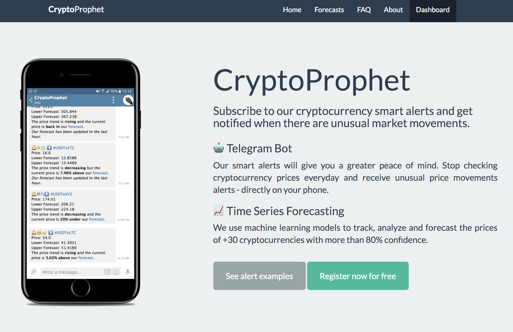

{:.profile}

{:.hello}
**Hi!** I am Ghyslain

# About

As Data Product Manager at [InReach Ventures](http://www.inreachventures.com/), I help transform the industry of venture capital through the development of our scalable investment workflow and automated proactive outreach - leveraging data and artificial intelligence.

My passion for entrepreneurship led me to start [Indie London](https://indieldn.com/) – a series of events for entrepreneurs, developers, and bootstrappers who wish to connect, learn and share their experience of running a business.

If you would like to get in touch, we can connect on [Twitter](https://twitter.com/iamghyslain) or [Linkedin](https://www.Linkedin.com/in/ghyslaingaillard).

# Projects

## Indie London
#### Founder (March 2018 - Present)

**[Indie London](https://indieldn.com/)** is the largest community worldwide of indie makers helping each other start and grow profitable online businesses.

I organise quarterly events with practical and visionary talks from experienced speakers, hosting up to 100 inspired attendees at top locations London.

We welcome bootstrappers, solo founders, software engineers, designers, product managers... Even if they are just starting out: we’re a community all about sharing and growing as a group.

Our previous partners and sponsors include Stripe, Cloudflare, EmailOctopus and Balsamiq.

[➡️ Visit our website to learn more.](https://indieldn.com/)

[🎧 Listen to my conversation with Courtland on the Indie Hackers podcast.](https://www.indiehackers.com/podcast/127-quick-chat-with-ghyslain-gaillard)

[📖Read my StartAMeetup.com to learn how to organize your own events](https://startameetup.com).

## CryptoProphet
#### Founder (June 2017 - February 2018)

**[CryptoProphet.co](https://web.archive.org/web/20180524165212/https://cryptoprophet.co/)** was a freemium forecasting SaaS used by over 700 cryptocurrency enthusiasts to predict and track prices via Telegram.

The project is now closed due to a lack of traction but you can read more about the journey:

- How I came up with the idea and iterated on the product: [Selling shovels in a gold rush: building a SaaS product for cryptocurrency enthusiasts (*Sept 17*)](https://medium.com/entrepreneurship-at-work/selling-shovel-during-the-gold-rush-building-a-saas-product-for-cryptocurrency-enthusiasts-7ff02bb0724e).

- How I followed the AARRR framework to grow total revenue to $1,000: [Lessons learned running a SaaS product for cryptocurrency enthusiasts (*Feb 18*)](https://medium.com/@ghyslain/how-cryptoprophet-uses-metrics-to-measure-growth-14e4a52f275c).

## Awards

- **[British Operational Research Society's May Hick Prize 2016](http://www.theorsociety.com/Pages/Awards/May.aspx)** for my masters dissertation at InReach Ventures: *Predict Investment Opportunities across Early-Stage European Tech-Startups*.

- **Winner of the [ProductHunt Global Hackathon 2017](https://blog.producthunt.com/winners-of-the-product-hunt-global-hackathon-2017-e2bad6adda39)** (Slack Category - $1,000 Prize) with Klue: the first Slack-based mystery game.

## Useful Resources

- [Machine Learning Bookshelf](http://ghyslain.me/bookshelf)

- [Best Reads on Entrepreneurship, Machine Learning and Software Engineering](https://ghyslain.me/library)
