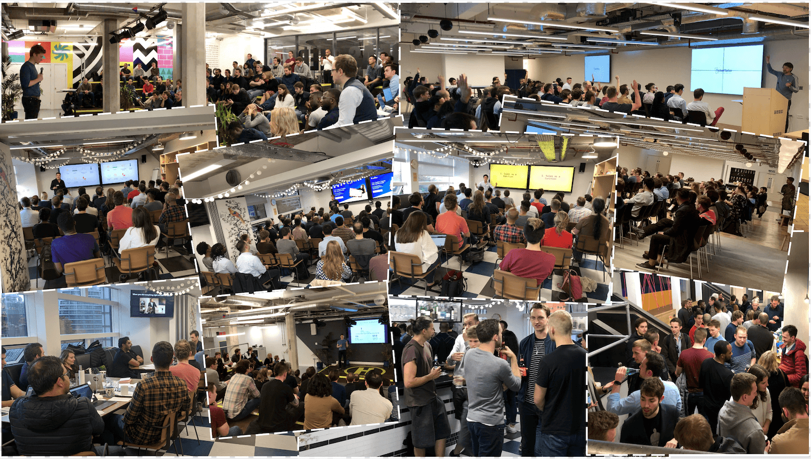

{:.profile}

{:.hello}
**Hi!** I am Ghyslain

## About

As Data Product Manager at [InReach Ventures](http://www.inreachventures.com/), I help transform the industry of venture capital through the development of our scalable investment workflow and automated proactive outreach - leveraging data and artificial intelligence.

My passion for entrepreneurship led me to start [Indie London](https://indieldn.com/) – a series of events for entrepreneurs, developers, and bootstrappers who wish to connect, learn and share their experience of running a business.

If you would like to get in touch, we can connect on [Twitter](https://twitter.com/iamghyslain), [Linkedin](https://www.Linkedin.com/in/ghyslaingaillard) or send me an email at [hi@ghyslain.me](mailto:hi@ghyslain.me)

## Indie London
#### Founder, Community Lead

**[Indie London](https://indieldn.com/)** is the largest community of indie makers helping each other start and grow profitable online businesses.

I organise quarterly events with practical and visionary talks from experienced speakers, hosting up to a 100 inspired attendees at top locations in the city.

We welcome bootstrappers, solo founders, software engineers, designers, product managers... Even if they are just starting out: we’re a community all about sharing and growing as a group.

Our previous speakers, partners and sponsors include Stripe, Cloudflare, EmailOctopus and Dependabot (now part of GitHub).

[Visit our website to learn more.](https://indieldn.com/)

## Past Projects

- **[CryptoProphet.co  (closed)](https://web.archive.org/web/20180524165212/https://cryptoprophet.co/)**: a forecasting tool to be notified of unusual cryptocurrency price movements  directly on your phone via Telegram.

## Awards

- **[British Operational Research Society's May Hick Prize 2016](http://www.theorsociety.com/Pages/Awards/May.aspx)** for my masters dissertation at InReach Ventures: *Predict Investment Opportunities across Early-Stage European Tech-Startups*.

- **Winner of the [ProductHunt Global Hackathon 2017](https://blog.producthunt.com/winners-of-the-product-hunt-global-hackathon-2017-e2bad6adda39)** (Slack Category) with Klue: the first Slack-based mystery game.

## Articles

- [Machine Learning Bookshelf](http://ghyslain.me/bookshelf)

- [Best Reads on Entrepreneurship, Machine Learning and Software Engineering](https://ghyslain.me/library)

- [Lessons learned running a SaaS product for cryptocurrency enthusiasts](https://medium.com/@ghyslain/how-cryptoprophet-uses-metrics-to-measure-growth-14e4a52f275c)

- [Selling shovels in a gold rush: building a SaaS product for cryptocurrency enthusiasts](https://medium.com/entrepreneurship-at-work/selling-shovel-during-the-gold-rush-building-a-saas-product-for-cryptocurrency-enthusiasts-7ff02bb0724e), *Entrepreneurship at Work*
